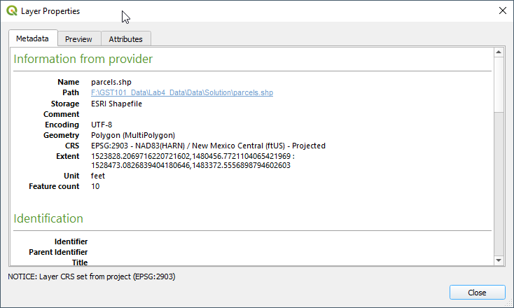
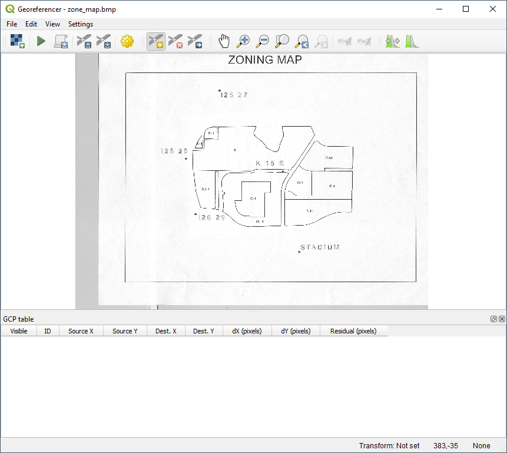
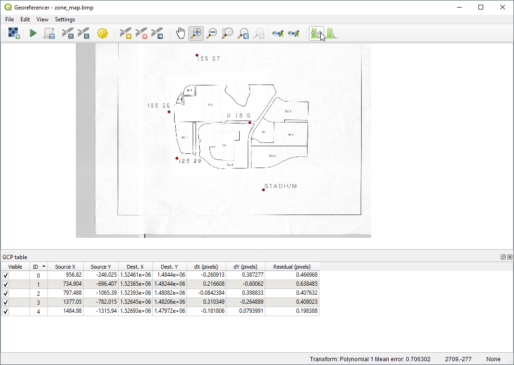
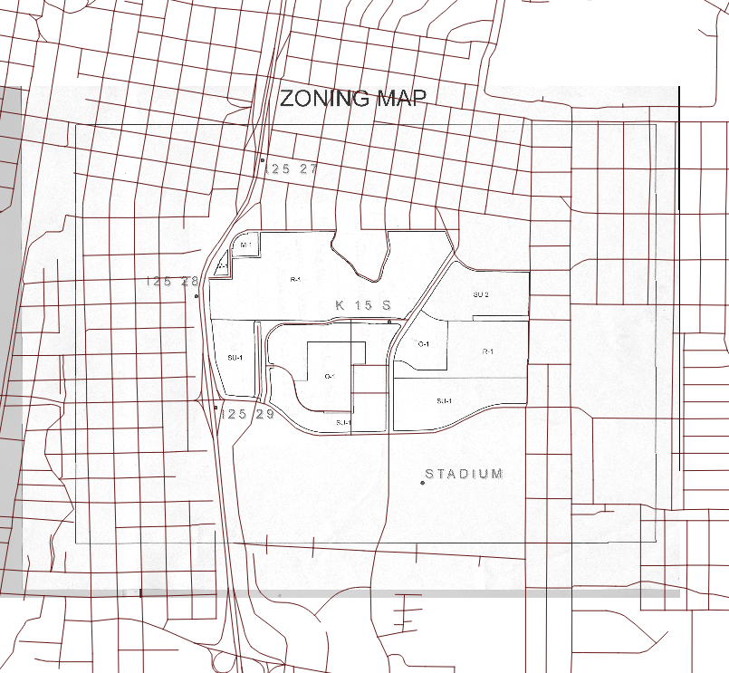
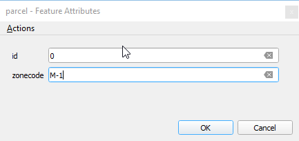
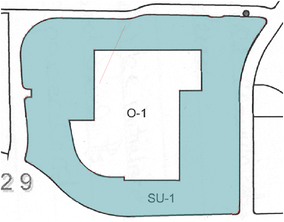
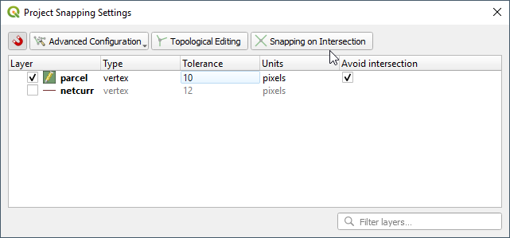
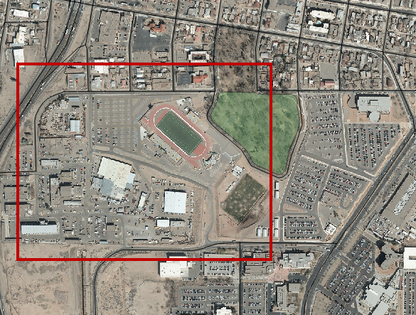
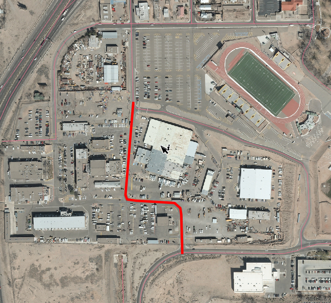

# Lab 5 - Creating Geospatial Data

!!! info "Document Version"
    Date: 29/12/2019
    
    **LibreGIS Lab Author:** Libre GIS, Germany  
    **FOSS4G Lab Author:**
    Kurt Menke, GISP
    Bird's Eye View GIS      
    **Original Lab Content Author:**
    Richard Smith, Ph.D.
    Texas A&M University - Corpus Christi
        
    The development of the original document is funded by the Department of Labor (DOL) Trade Adjustment Assistance Community College and Career Training (TAACCCT) Grant No.  TC-22525-11-60-A-48; The National Information Security, Geospatial Technologies Consortium (NISGTC) is an entity of Collin College of Texas, Bellevue College of Washington, Bunker Hill Community College of Massachusetts, Del Mar College of Texas, Moraine Valley Community College of Illinois, Rio Salado College of Arizona, and Salt Lake Community College of Utah.  This work is licensed under the Creative Commons Attribution 3.0 Unported License.  To view a copy of this license, visit http://creativecommons.org/licenses/by/3.0/ or send a letter to Creative Commons, 444 Castro Street, Suite 900, Mountain View, California, 94041, USA.  
    This document was original modified from its original form by Kurt Menke and continues to be modified and improved by generous public contributions.
    
    **Current document (dated: 29/12/2019) is modified from its original form by LibreGIS and continues to be modified and improved by generous public contributions.**

!!! Objective
    Digitize Information from a Scanned Hardcopy Source

## 1. Introduction

In this lab, students will learn how to georeference a scanned map. Georeferencing is the process of transforming the coordinate system of the scanned map, from the coordinate system produced by the scanning process, into a real world projected coordinate reference system. The student will then learn how to digitize information contained in the scanned map into a shapefile. The first task will be to create the empty shapefile to digitize features into. The student will also learn how to edit existing vector datasets.

This lab will continue to introduce students to the QGIS interface. It is important to learn the concepts in this lab as future courses will require the skills covered in this lab. 

This lab includes the following tasks:

+ Task 1 – Create a new shapefile.

+ Task 2 – Transforming coordinate system of source data.

+ Task 3 – Heads-up digitizing from transformed source data.

+ Task 4 – Editing existing geospatial data.

## 2. Objective: Digitize Information from a Scanned Hard Copy Source

While there is a large amount of digital information readily available to users of GIS, there’s still a large amount of information that has not been converted to digital format. For hundreds of years of hard copy paper maps contained all geospatial data. Many historic, and even newer, hard copy maps have never been digitized. It is possible to extract the information from hardcopy sources through process called digitizing. In this lab, you will use heads-up digitizing to digitize parcels in a portion of Albuquerque, New Mexico from a scanned map. This will be accomplished through a five-step digitizing process:

1. Create a shapefile to store the data that will be digitized.

2. Load the scanned map source data  into QGIS

3. Georeference the source map

4. Digitize parcels

5. Save

## Task 1 - Create a New Shapefile

In Task 3, you will be digitizing parcels from a georeferenced data source. In this first task you will learn how to create the new shapefile you will eventually digitize into.

1. Open QGIS Browser.

2. Navigate to the lab folder in the file tree and select the Data folder by clicking once on it so that it is highlighted.

3. Click on the New Shapefile button at the top of the Browser window. This will open the New Vector Layer window.

4. Choose a type of ‘Polygon’

5. Click the Select CRS button to open the Coordinate Reference System Selector.

The City of Albuquerque, like most municipalities, uses the State Plane Reference System (SPRC) for their data. You will use the same CRS for your new shapefile.

5. In the Coordinate Reference System Selector interface type New Mexico into the Filter. This will limit the list below to just those with New Mexico in their name. These are different SPRC CRSs for New Mexico. New Mexico has 3 zones and Albuquerque is in the Central zone.

6. Select the NAD83(HARN) / New Mexico Central (ftUS) with an EPSG code of 2903 (see figure below). Click OK once you have selected this CRS to be returned to the New Vector Layer window.

While creating your new shapefile you have the option of adding attribute columns. It is possible to add them later, but if you know of some attribute columns you will need in the layer, it makes the most sense to define them here.  The ID attribute is automatically added to every shapefile you create.

For this lab, you will need an attribute column to hold the zoning code.

6. In the New attribute section of the New Vector Layer window, define a new field with: a name of zonecode, as Text data with a width of 5.

This means the new zonecode attribute column will store data as text and will only be able to accommodate five characters of data. Since our longest zoning code is 4 digits this is more than enough.

8. Click Add to attribute list and you will see the new zonecode attribute added.

9. Click OK to approve the new shapefile options and open the Save layer as window. Since you had the New Data folder selected when you clicked the New Shapefile button it will default to that folder. If it doesn’t just navigate to that folder now. 
10. Name the shapefile parcels.shp and click Save to create the shapefile

Initially, the new shapefile may not display in the Browser. We need to first refresh the view to see the newly-created file.

11. Click the Refresh button in the upper left hand corner of the QGIS Browser window. Expand the New Data folder and you will see the parcels.shp file.

11. Select the parcels.shp dataset and click the Metadata tab. You’ll see that it has 0 features and has the Spatial Reference System you specified. The New Mexico Central State Plane zone uses the Mercator projection since it is a north – south oriented zone.

## Task 2 - Transforming Coordinate System of Source Data

Now that you have created an empty shapefile to store the digitized information, you will perform a coordinate transformation (also known as georeferencing) on the source data set so that it is in an Earth-based coordinate system. In this case, the coordinate system will match your parcel shapefile (NAD83(HARN) / New Mexico Central (ftUS)).

To perform this task you will be using a Plugin. Plugins are small add-ons to QGIS. Some are created by the core QGIS development team and others are created by third party developers. 

1. Open QGIS Desktop.

2. Open QGIS Browser.

3. Arrange Browser and Desktop so that you can see both windows simultaneously on your desktop. 

4. In Browser find the new parcels shapefile. Select it and drag it onto the map window of QGIS Desktop. This is another way to add data to Desktop. 

5. From the Menu bar in QGIS Desktop, choose Project | Project Properties.
6. Click the CRS tab and Enable ‘on the fly’ CRS transformation. Click OK to save the setting and close the properties window.

6. The project should now have a CRS of EPSG 2903 (which is NAD83(HARN) / New Mexico Central (ftUS)) and on the fly CRS transformation is enabled. You can check this by looking at the lower right hand corner of QGIS Desktop and ensuring that EPSG: 2903 (OTF) is listed. If not right click on the parcels layer and from the context menu choose Set Project CRS from Layer.

7. Save the project to the Lab 5 folder and name it Lab5.qgs.

8. From the menu bar choose Plugins | Manage and Install Plugins

9. The Plugins manager will open. Options along the left side allow you to switch between Installed, Not Installed, New, and Settings. The plugin you will use is a Core QGIS Plugin called Georeferencer GDAL. 

10. Since it is a Core plugin it will already be installed. You just need to enable it. Click on Installed plugins and check the box next to Georeferencer GDAL (shown in figure below).

11. Click Close to close the Plugins window.
12. To open the Georeferencer plugin go to the menu bar choose Raster | Georeferencer | Georeferencer.

12. The Georeferencer window opens. Click the Open Raster button at the upper left hand side (see figure below).

13. Navigate to the Lab 5/Data folder and select the zone_map.bmp and click Open. *Note:* If the Coordinate Reference System Selector window opens click Cancel to close. This dataset does not yet have an Earth-based coordinate system. The source data will now be loaded in the Georeferencer (shown in figure below)

The source data is a map. On the map, there are 5 points with their associated names (for example, one point's name is: I25 27). These are benchmarks maintained by the National Geodetic Survey. To georeference this scanned map, you will create control points at these five locations. The plugin will then develop a georeferencing equation based off the set of source and target coordinates at these five locations. QGIS will obtain the source coordinates from your mouse click on those points. You will look up the target coordinates for these benchmarks from the NGS website. 

14. The NGS website is at [http://www.ngs.noaa.gov/cgi-bin/datasheet.prl](http://www.ngs.noaa.gov/cgi-bin/datasheet.prl). Open the site. *Note*: If you are unable to access the internet, the NGS Data Sheets have been downloaded and saved in the Lab 5/Data/NGS Data Sheets folder. Please read the next few steps to learn how the NGS Data Sheets were acquired.

You will search for each of the benchmarks that appear on the map by searching for each benchmark’s datasheet.  You will use the Station Name option to do the search.  

15. On the website click on the DATASHEETS button. Then click on the link for Station Name.

16. To find the first station, enter the station name of I25 27 (include the space), and then choose NEW MEXICO for the state. The search is shown in the figure below. *Note*: the station name is I25 27 with a capitalized letter i.

The search should return the page shown in the figure below. 

18. Highlight the station name and click the Get Datasheets button and you will get something that looks like the figure below.

This is an NGS Data Sheet.  It gives measurement parameters for NGS benchmarks located throughout the United States.  One piece of information it includes are coordinates for benchmarks in State Plane feet (highlighted in the figure above). There are two sets of State Plane coordinates on the NGS Data Sheet; one is in meters (MT) and one is in feet (sFT). Be sure to use the set in feet. *Important Note*: There is a dash before the North coordinate. It is *not* a negative number.  

19. Find the data sheet for each benchmark shown in the map and fill in the coordinates below. The coordinates for the first station have been entered already. *Note*: If you are unable to access the internet, the NGS Data Sheets have been downloaded and saved in the Lab 5/Data/NGS Data Sheets folder.

		Benchmark | Northing      | Easting
		I25 27	    1,484,404.48    1,524,608.32

		I25 28

		I25 29

		K 15 S

		STADIUM

20. The next step is to enter the control points in the Georeferencer. Click on the Add point button . 

It is important to be precise and click directly on the point. To help make your selection more precise, you can zoom and pan by using tools in the View toolbar (shown in figure below). If you want to redo a control point click the Delete point button  then click on the point to delete.) 

21. With the Add point button selected, click on point I25 27.

22. The Enter map coordinates window opens. Enter the easting and northing State Plane Coordinates that you retrieved from the NGS Data Sheet into the two boxes. Make sure you enter them correctly. The correct coordinates are entered for I25 27 in the figure below. 

22. Click OK and a red control point will appear on the map where you clicked. The source (srcX, srcY) and destination (dstX, dstY) X,Y coordinates will display in a table at the bottom of the window.

23. Repeat this procedure for points ‘I25 28’, I25 29’, K 15 S’ and ‘STADIUM’. After the 5 control points have been entered your Georeferencer window should look like the figure below.

23. To perform the transformation click the Start georeferencing button .

24. The Transformation settings window will open (see figure below). If beforehand you get a message saying ‘Please set transformation’ type click OK. 

	1. In the Transformation window choose the Polynomial 1 as the Transformation type. 
	
	2. Choose Nearest neighbor as the Resampling method. This is the standard raster resampling method for discrete data such as a scanned map. 
	
	3. Click the browse button to the right of Output raster. Navigate to your Lab 5/Data folder.

	4. Create a new folder named New Data then enter the folder.

	5. Name the file zone_map_modified_spcs.tif and click Save.
	
	4. Click the browse button to the right of Target SRS. Type 2903 into the Filter.

	6. Click the NAD83(HARN)/New Mexico Central (ftUS):2903 CRS then click OK.

	5. Check Load in QGIS when done.
	
	6. Click OK to close the Transformation settings window and perform the transformation.

25. Close the Georeferencer and Save GCP points when prompted.

26. Right click on the zone_map_modified.tif and choose Zoom to layer extent to see the georeferenced image.

27. Using the Add vector data button add the netcurr.shp shapefile in the Lab 5/Data folder to QGIS. This is a shapefile representing city streets produced by the City of Albuquerque. If the transformation was done correctly, the streets will line up with the georeferenced parcel map image (shown in figure below). Save your map file.

## Task 3 - Heads-up Digitizing From Transformed Source Data

Now you will digitize the parcels off the georeferenced image into the parcels shapefile.

1. Drag the parcels layer above the zone_map_modified_spcs layer in the Layers panel. Right click on parcels and choose Toggle editing. This puts the parcels layer into edit mode. Notice that a pencil appears next to the layer in the Layers panel indicating that layer is in edit mode. Only one layer can be edited at a time. 

2. Turn off the netcurr layer's visibility.

2. Using the Zoom in tool, drag a box around the M-1 parcels in the northwest corner of the image. You will digitize these first.

There is an Editing toolbar for editing vector datasets (see figure below). If you do not see that go to the menu bar to View | Toolbars and turn it on. The tools available change slightly depending on the geometry of the data you are editing (polygon, line, point).When editing a polygon layer you will have a tool for adding polygon features.

3. Click on the Add Feature tool . Your cursor will change to an editing cursor that looks like a set of cross hairs.

Polygons are constructed of a series of nodes which define their shape. Here you will trace the outline of the first parcel clicking to create each node on the polygons boundary.

4. Put your cursor over a corner of one of the polygons. Left click to add the first point, left click again to add the second, and continue to click around the perimeter of the parcel. After you have added the final node finish the polygon with a right click.

5. An Attributes window will open asking you to populate the two attributes for this layer: id and zonecode. Give the parcel an id of 0 and the zonecode is M-1 (shown in figure below). Each parcel feature will receive a unique id starting here with zero. The next parcel you digitize will be id 1, the one after that id 2 etc. 

6. Click OK to close the Attributes window and complete the polygon.

If you want to delete the polygon you have just added, click the Current Edits tool dropdown menu  and choose Roll Back Edits to undo your polygon.

6. Adding single isolated polygons is pretty straightforward. Zoom back to the extent of the image. You can do this by clicking the Zoom last button .

7. Find the big parcel in the south central area. There is a parcel with zoning code SU-1 that wraps around O-1. Zoom to that area.

8. Open the Layer properties | Style tab for the parcels layer and set the Layer transparency to 50%. This will allow you to see the source data underneath your parcels as you digitize.

9. Digitize the outer boundary of the SU-1 parcel ignoring the O-1 parcel for the moment. Fill in the attributes when prompted (id=0, zonecode=SU-1). The SU-1 polygon will be a ring when completed but for now it covers the O-1 parcel. 

10. To finish SU-1 you will use a tool on the Advanced Editing toolbar. To turn that on go to the menu bar and choose View | Toolbars | check Advanced Editing. Dock the Advanced Editing toolbar where you would like (toolbar shown in figure below). (All toolbars in the QGIS interface can be moved by grabbing the stippled left side and dragging them to different parts of the interface.)

11. Now you’ll use the Add Ring tool . Select it and click around the perimeter of the O-1 parcel. Right click to finish. This creates a ring polygon (shown in figure below).

14. To Digitize O-1 you will use a tool that is part of the Digitizing Tools Plugin. First open the Plugin Manager and search for 'Digitizing Tools' in the All category. Select the Plugin and click the Install Plugin button. You should get the message Plugin Installed Successfully. Once it has been installed switch to the Installed plugins and make sure the Digitizing Tools toolbar is visible. Dock the toolbar.

15. On the Attributes tool, click the Select Features... tool  and select the SU-1 polygon.

17. On the Digitizing toolbar, select the dropdown next to the Fill ring with a new feature (interactive) tool and select Fill all rings in selected polygons with new features tool (selection shown in figure below).

.

15. You will immediately be prompted to enter the attributes for the new O-1 polygon (id=2, zonecode=O-1).

16. Click OK when done and the new polygon will appear. It automatically fills the space leaving no gaps.

16. Use the Identify tool  to click on O-1 and SU-1 and verify that they are digitized correctly.

*Note*: If you end up needing to move one or two misplaced vertices on a finished polygon you can do that. Use the Select Single Feature tool  to select the polygon, and then use the Node Tool  to select the individual node and move it.

To digitize the remaining polygons, we will first turn on snapping options to make it easier to have adjacent polygons share vertices and/or segments.

17. To do so first you will set your snapping environment. Go to the menu bar and choose Settings | Snapping options.

This is a window that lets you configure what layers you can snap to while editing and set the snapping tolerance. The Snapping mode lets you control what portions of a feature are being snapped to.

+ To Vertex will snap to vertices
+ To Segment will snap to any part of another layers edge
+ To Vertex and Segment will snap to both.

The Tolerance determines how close your cursor needs to be to another layer before it snaps to it. It can be set in screen pixels or map units. In our case map units are feet.

13. For Snapping mode, change it to Advanced. The Snapping options dialog will now show a list of map layers and options.

15. Check parcels since we want to snap our parcels to that layer. Set the tolerance for parcels to 50 map units and choose a Mode of 'to vertex'.

16. Check the box under Avoid intersections to the right of Units (shown in the figure below). This enables Topological editing. When digitizing a shared boundary with this option checked you can begin with one of the vertices at one end of the shared boundary. Then continue digitizing the boundary of the new polygon and end at a vertex at the other end of the shared boundary. The shared boundary will be created automatically eliminating digitizing errors.

The map units are feet so when you get within 50 feet of a node (aka vertex) you will snap to it. This allows you to be much more precise than you could otherwise.

13. Click OK to set the Snapping options.

If snapping is interfering with digitizing a parcel polygon you can go to Settings | Snapping options at any time (even during digitizing) and turn snapping off until you need it again. 

17. Finish digitizing the polygons. Anytime you have a parcel that shares a boundary with another, use snapping to make sure you create two parcels without a gap in between.

Remember you can adjust the snapping tolerance and what features are being snapped to Vertex, Segment and Vertex and Segment.

18. When finished, click the Toggle Editing  button to exit out of editing mode. You will be prompted to save your changes. Click Save to save the edits.

19. Turn off the zone_map_modified_spcs raster. You are done with that now. It was an intermediate step necessary to get the parcel boundaries digitized.

20. Save your QGIS project.

## Task 4 - Editing Existing Geospatial Data

Now that you have digitized data into the empty shapefile you created, you will learn how to modify existing shapefiles.

1. Click the Add Raster Layer button and navigate to the Lab 5/Data folder.
2. 
2. Set the filter to Multi-resolution Seamless Image Database (*.sid, *.SID).
3. 
3. Add all four SID images.

2. Drag the parcels layer above the image in the Layers panel. 

5. Turn off the parcels layer.

13. Now you will make an edit to a line layer. Turn on the netcurr layer.

14. Zoom into the location highlighted in Figure below.

You will digitize the missing main road, shown in yellow in the figure below.

16. Toggle on editing for netcurr.

17. Set your Snapping options so that only netcurr is being snapped to, with a Mode of To Vertex and a Tolerance of 20 feet. 

18. Using the Add Feature tool on the Editing toolbar ,  digitize the new road making sure to snap to the roads at the northern and southern ends. Use the centerline of the road while digitizing.

19. There are many attributes for this layer. You will just enter a few. Enter the STREETNAME as Park, the STREETDESI as Place, the STREETQUAD as SE and the COMMENTS as Lab 5. Click OK.

20. Toggle off editing and Save.

## 4. Conclusion

In this lab, you have successfully digitized information using the five-step digitizing process.  Additionally, you have recreated the original source data (scanned as a raster) in the vector format.  Digitizing can be a time-consuming and tedious process, but can yield useful geographic information.

## 5. Discussion Questions

1. What can contribute to errors in the georeferencing process?

2. What other vector geometries (point/line/polygon) could be appropriate for digitizing a road?  In which instances would you use one vector geometry type over another?

3. When you created the parcels shapefile you added a text field to hold the zoning codes. What are the possible field types?  Explain what each field type contains, and provide an example of a valid entry in the field.

4. Aerial photography has a lot of information in it. What other features could you digitize from the imagery in this lab? Explain what vector geometry you would use for each. 

## 6. Challenge Assignment (optional)

You have successfully created the parcel data from a scanned map. You have also fixed the roads data in this part of town. There are some sports facilities visible: two football fields and a baseball field. Create a new layer and digitize those three facilities (include the grassy field areas at a minimum). 

Create a simple page sized color map composition using the QGIS Desktop Print Composer showing your results. Show the parcels, sports facilities, parks, roads and aerial photography. Use Categorized styling to give a unique color to each zone code in the parcel data.  Include:

+ Title

+ Legend (be sure to rename your layers so that the legend will be meaningful.)

+ Date and Data Sources

You can credit the data sources as the City of Albuquerque and yourself. If you need to refresh your memory on creating a map layout, review GST 101 Lab 4.