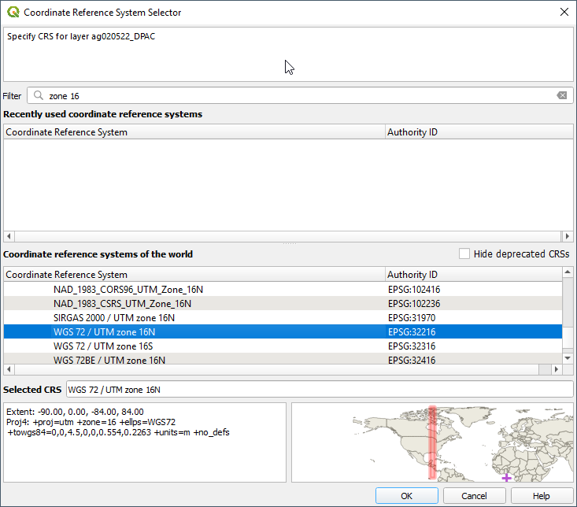
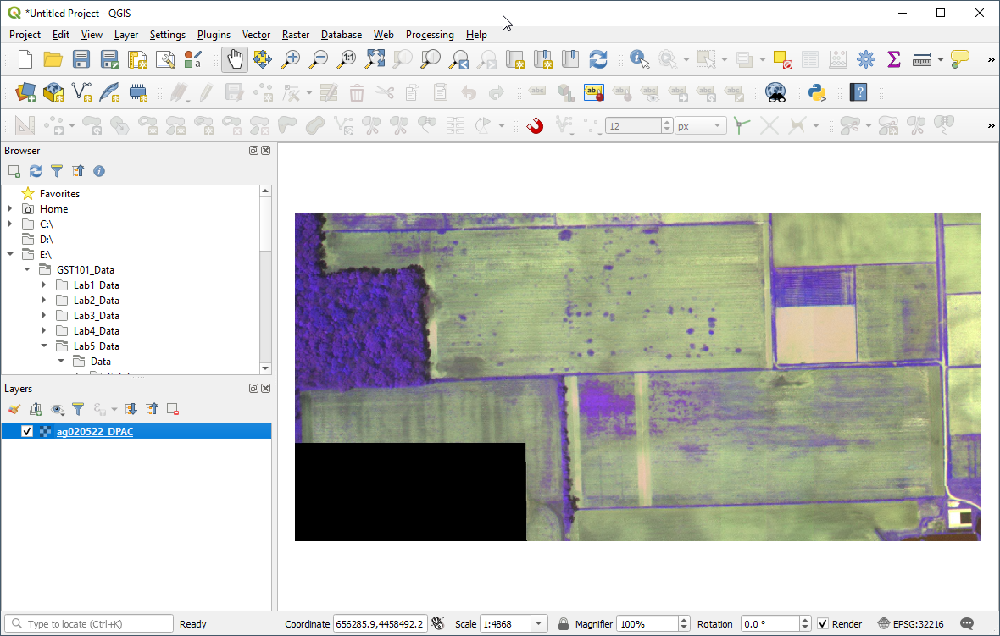
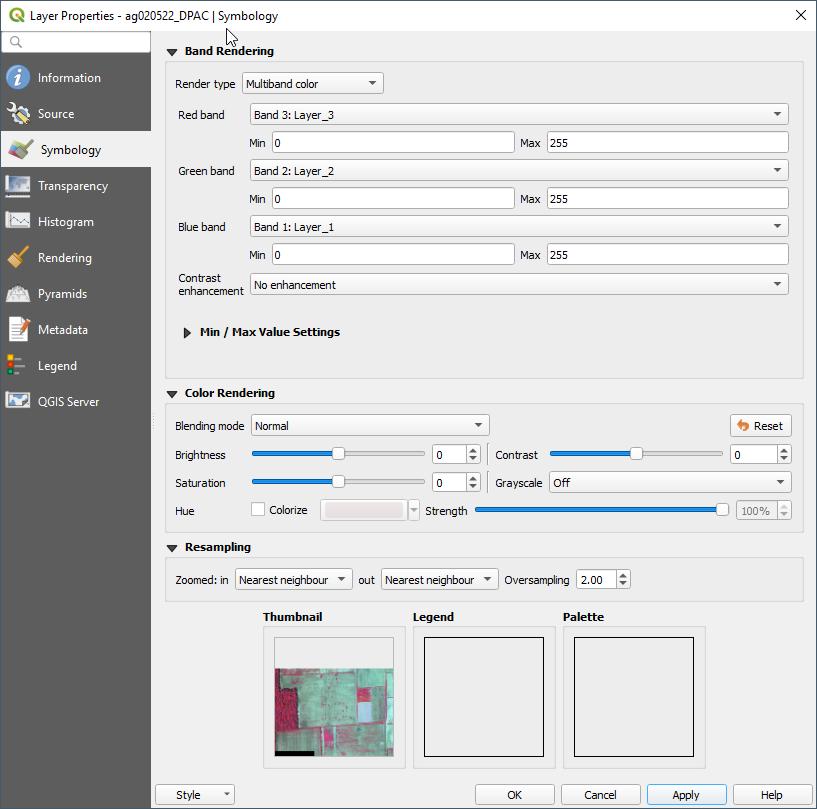
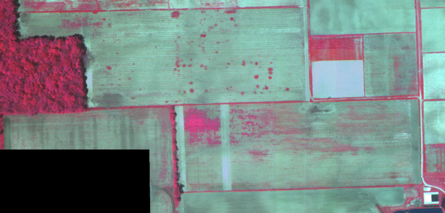
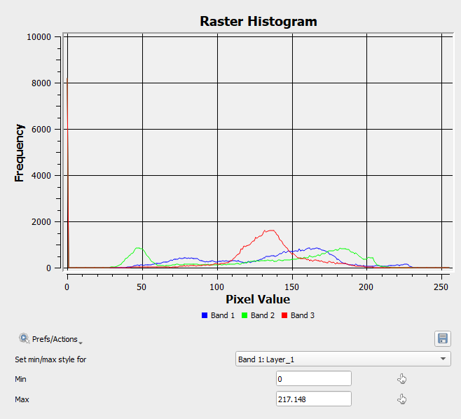

# Lab 5 - Understanding Remote Sensing and Analysis

!!! warning "Document Version"
    Date: 29/12/2019
    
    **LibreGIS Lab Author:** Libre GIS, Germany  
    **FOSS4G Lab Author:**
    Kurt Menke, GISP
    Bird's Eye View GIS      
    **Original Lab Content Author:**
    Richard Smith, Ph.D.
    Texas A&M University - Corpus Christi
        
    The development of the original document is funded by the Department of Labor (DOL) Trade Adjustment Assistance Community College and Career Training (TAACCCT) Grant No.  TC-22525-11-60-A-48; The National Information Security, Geospatial Technologies Consortium (NISGTC) is an entity of Collin College of Texas, Bellevue College of Washington, Bunker Hill Community College of Massachusetts, Del Mar College of Texas, Moraine Valley Community College of Illinois, Rio Salado College of Arizona, and Salt Lake Community College of Utah.  This work is licensed under the Creative Commons Attribution 3.0 Unported License.  To view a copy of this license, visit http://creativecommons.org/licenses/by/3.0/ or send a letter to Creative Commons, 444 Castro Street, Suite 900, Mountain View, California, 94041, USA.  
    This document was original modified from its original form by Kurt Menke and continues to be modified and improved by generous public contributions.
    
    **Current document (dated: 29/12/2019) is modified from its original form by LibreGIS and continues to be modified and improved by generous public contributions.**

!!! note "Objective"
    Explore and Understand How to Display and Analyze Remotely Sensed Imagery
  

## 1. Introduction

In this lab, students will learn how to display and inspect multi-band imagery in QGIS Desktop. They will use QGIS data processing tools to conduct an unsupervised classification of multi-spectral imagery.  They will then use MultiSpec to perform a more advanced analysis. MultiSpec is a freeware multispectral image data analysis system created at the Purdue Research Foundation.  MultiSpec provides the ability to analyze and classify imagery data, among other tasks.  This lab has been adapted from four tutorial exercises provided by the MultiSpec team and provides an introduction to the software package.
This lab includes the following tasks:

+ Task 1 – Display and Inspection of Image Data

+ Task 2 – Supervised Classification

## 2. Objective: Learn the Basics of using QGIS Desktop and MultiSpec for Image Analysis

Image analysis is one of the largest uses of remote sensing imagery, especially with imagery that has recorded wavelengths beyond the visible spectrum. There are proprietary software packages designed specifically for remote sensing work such as ENVI and ERDAS Imagine. QGIS Desktop can now be used in combination with two additional FOSS4G software's, SAGA and GRASS, to also conduct image analysis. SAGA and GRASS are both standalone software packages that can be installed separately. However, the main analysis tools from both are now bundled with QGIS Desktop. This means that no additional installations are required in order to use GRASS and SAGA analysis tools via QGIS Desktop. Some of this functionality is for more advanced users. For this reason you will also learn how to use MultiSpec which is a very simple and intuitive, but powerful, freeware image analysis software package. This lab was adapted from the first four tutorials provided by the MultiSpec team. 

## Task 1 - Display and Inspection of Image Data

There are many way to view multi-band image data. Here you will explore some display options for a multi-band image in QGIS Desktop.

1. Open QGIS Desktop.

2. Click the Add Raster Layer button and navigate to the `GST101\data\Lab5` folder. Set the filter to All files (\*)(\*.\*).

3. Select the file named ag020522_DPAC.img and click Open.

    This raster layer does not have a defined coordinate reference system (CRS). Therefore, QGIS opens the Coordinate Reference System Selector window. If this window does not open automatically, double-click the layer and click the Select CRS button under the General tab. This interface lets you define the CRS before the layer is added to the Layers panel. This raster is in UTM, zone 16, WGS84. 

4. Type ‘zone 16’ into the Filter window. In the Coordinate reference systems of the world box you’ll see a list of all the CRSs with zone 16 in the name. Scroll through until you find WGS/84 UTM zone 16N (EPSG: 32616). Select it so that it appears in the Selected CRS box (see figure below) and click OK .

    

5. The image will be added to QGIS (shown in figure below). This is an aerial photograph of a portion of the Davis Purdue Agriculture Center in Randolph County, Indiana.

    

6. Save your QGIS Desktop project to your lab folder as Lab5.qgs

7. Double click on the layer name in the Layers panel to open the Layer Properties. Click on the General tab.

    Layer info shows you the layer name, where the data are stored on your computer and the number of columns (1,501) and rows (709). Since you set the CRS for the image when you added it to QGIS, the CRS is listed under Coordinate Reference System. Scale dependent visibility allows you to control at what scales the layer is visible. You will not set this parameter here. If you wanted the image to be visible only at a certain scale range, you could check the box and enter a scale maximum and minimum.

8. Click on the Style tab. 

    This image has three bands. Each band represents a segment of the electromagnetic spectrum. In this case band 1 represents the red portion, band 2 the green portion, and band 3 the near-infrared portion. Therefore, in this image, we are able to see characteristics of the landscape that we cannot see with our eyes, since they can only etect visible light.

    When an image has multiple color bands, QGIS defaults to a Multiband color rendering of that image. Colors on your computer monitor are created by combining three color channels: red, green and blue (RGB). By selecting three bands from a multiband image, and illuminating them with either red, green or blue light we create a color image. The multiband color renderer defaults to displaying Band 1 through the red channel, Band 2 through the green channel and Band 3 through the blue channel. However, we can change which bands are displayed through which channels. 

9. Click the drop-down arrow for the Red band and change it to Band 3. Change the Blue band to Band 1 (see figure below).

    

10. Click Apply and move the Layer Properties window so you can see the raster.

    *Note*: The difference between using Apply and using OK. Clicking OK saves the changes and closes the dialog window. Apply saves the changes and leaves the window open. If you want to change a setting, see the result and change another setting use Apply.

11. The image should now look like the figure below. This band combination creates what is known as a false color composite. Vegetation reflects a lot of near-infrared energy. You are now looking at the near-infrared through the red channel so vegetation shows up as red tones. The brighter the red, the more vigorous and healthy the vegetation.

    

    The Style tab also allows you to adjust Contrast enhancement. This setting gives you options to modify the appearance of the image when used in combination with the Load min/max values settings. Each band has values from 0-255. By default, the renderer is set to use Cumulative count cut values from 2% to 98%. This setting eliminates the bottom and top 2% of the values. Many images have some outlying very low and high data values. These outlying data values can be eliminated by using the Cumulative count cut option.  The Contrast enhancement is set by default to No enhancement. 

12. Click the Load button. The values currently being used for each band will appear in the Min/max boxes in the Band rendering area. 

13.	Change the Contrast Enhancement to Stretch to MinMax and click Apply. This setting scales the colors between the minimum and maximum values.  The image gets a little brighter (see figure below) because the colors are now being stretched across the range of values. You are both applying a stretch and eliminating the bottom and top 2% of the values with the default Cumulative count cut setting.

    
    
    The Accuracy setting lets you either estimate the range of values from a sample or get the actual values. Obtaining actual values can take longer since QGIS has to look at all the values in the image, instead of a sample. 

14. Change the Accuracy setting to Actual, and click the Load button to see the values change slightly.

15. Now choose a Load min/max values setting of Mean +/- standard deviation and click Load. Click Apply to see the image change. 

    The raster gets a more saturated appearance (shown in figure below). These are the values within one standard deviation of the mean value. This is useful when you have one or two cells with abnormally high values in a raster grid that are having a negative impact on the rendering of the raster.

    

16. You can also look at one individual band. Change the Render type to Singleband gray. Choose Band 3 as the Gray band. Set the Contrast enhancement to Stretch MinMax. Click Apply.

    

17. Change the Gray band setting to each of the other two bands and see how different they look.

18. Change back to a false color composite view: 

	a. Render type: Multiband color

	b. Red band = 3

	c. Green band = 2

	d. Blue band = 1

	e. Contrast enhancement = Stretch to MinMax

	f. Click Load

	g. Click Apply 

19. In the Layer Properties, click on the Transparency tab. 

20. With the Global transparency setting you can control how transparent the entire image is. 

21. You can also define image values that you want to be transparent. Notice that in the southwest corner there is a black rectangle with no image data. On the Transparency tab click the Add values from display button  then click on the black rectangle on the map. QGIS will measure the values for all three bands where you clicked and enter them into the Transparent pixel list.

22. Click Apply. The black rectangle of no data pixels disappears.

    

23. Click on the Pyramids tab. 

    Raster data sets can get very large. Pyramids help render large images more quickly. Without them, QGIS will try to render each pixel in an image even though your monitor may not have enough resolution to display each pixel. Pyramids are lower resolution versions of the image that will increase performance. This particular image is small so you will not build any now. 

24. Click on the Histogram tab. 

    Here you can view the distribution of data values in your raster. If it is a multi-band image, you can view data for each band. The histogram is generated automatically when you open this tab (see figure below). You can save the histogram as an image with the Save plot button.

    

25. Save your QGIS Desktop project.

## Task 2 - Supervised Classification
TODO: In Progress

## 3. Conclusion
In this lab, you have learned the basics of working with multi-spectral imagery in QGIS Desktop. You learned how to access data processing tools in QGIS Desktop and how to do a Supervised Classification in MultiSpec, a freeware multispectral image data analysis system.  MultiSpec is an excellent example of many free-to-use programs available for imagery analysis and GIS-related tasks.  

## 4. Discussion Questions

1. What other objects in imagery could you identify via supervised classification?  Describe two use-cases.

2. Even though the imagery used in this lab contained recordings of wavelengths beyond the visible spectrum, why do you think each range of hyperspectral information was mapped to the colors red, green, and blue?

3. In lecture, you learned that photointerpretation is the process of converting images to information through human interpretation.  Based on the results of tasks 2 and 3 in this lab, do you think that computers can interpret as well as humans?

## 5. Challenge Assignment (optional)

You have used MultiSpec to perform a Supervised Classification of the multi-spectral imagery. You have also seen that you can do an analysis in MultiSpec and bring the data into QGIS.

Create a simple page sized color map composition using the QGIS Desktop Print Composer showing your results. Show the Supervised Classification. Include:

+ Title

+ Legend (be sure to rename your layers so that the legend will be meaningful.)

+ Date and Data Sources

You can credit the data sources as the Purdue Research Foundation and yourself. If you need to refresh your memory, review GST 101 Lab 4.
